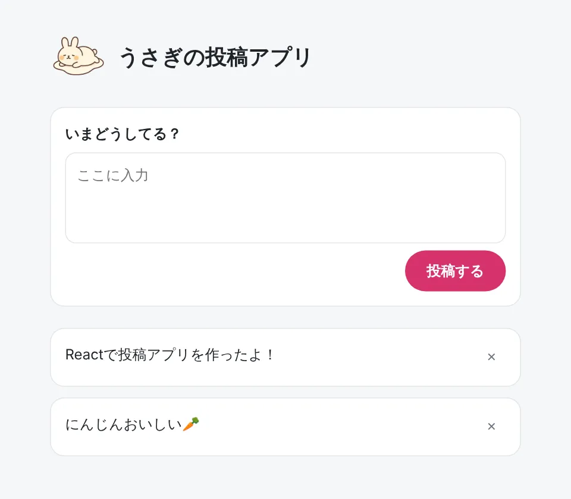

# フロントエンド入門（React + Vite）

HTML・CSS・JavaScript の基本を、小さな投稿アプリを作りながら学びます。
対象：Windows 11



---

## 1. 準備する（最初の1回だけ）

PowerShell を開いて、次の3行を実行します。

```powershell
winget install OpenJS.NodeJS.LTS
winget install Microsoft.VisualStudioCode
winget install Git.Git
```

PowerShell を開き直して、バージョンが表示されれば OK です。

```powershell
node -v
```

> GitHub アカウントは、チーム開発をするときに [ここ](https://github.com/signup) で作成しましょう。

---

## 2. プロジェクトを作る

```powershell
npm create vite@latest myapp -- --template react --immediate
```

ブラウザで http://localhost:5173 を開き、ページが表示されれば成功です 🎉

- 止めるとき：`Ctrl + C`
- 次回から起動するとき：`cd myapp` → `npm run dev`
- VS Code で開くとき：`code myapp`

---

## 3. アプリを作る

👉 [うさぎの投稿アプリを作ろう](./example/)
